# Yugioh-Icons

Assets for Yu-Gi-Oh! related projects! 

Big thanks to [EmonyChan](https://twitter.com/EmonyChan) for her work on the attribute icons and the upscaling of the rest.

You can download a zip version of these [here](https://github.com/diamonddudetcg/Yugioh-Icons/archive/refs/heads/main.zip)

## Attribute Icons

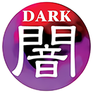 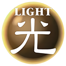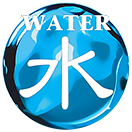 

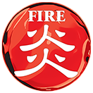 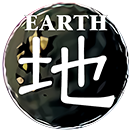 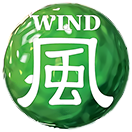

 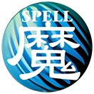 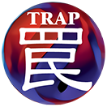

## Spell / Trap card types

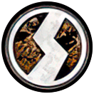 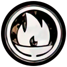 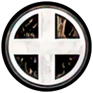

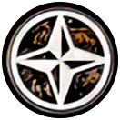  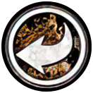

## Monster stat icons

 

 

## Monster Type icons

| Type | Icon |
| ---- | ---- |
| Aqua |  |
| Beast |  |
| Beast-Warrior | 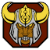 |
| Creator God | 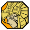 |
| Cyberse |  |
| Dinosaur |  |
| Divine Beast |  |
| Dragon |  |
| Fairy |  |
| Fiend | 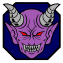 |
| Fish |  |
| Insect | 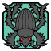 |
| Machine | 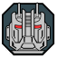 |
| Plant | 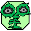 |
| Psychic |  |
| Pyro |  |
| Reptile | 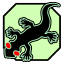 |
| Rock | 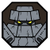 |
| Sea Serpent |  |
| Spellcaster |  |
| Thunder |  |
| Warrior |  |
| Winged Beast | 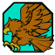 |
| Wyrm | 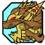 |
| Zombie |  |
